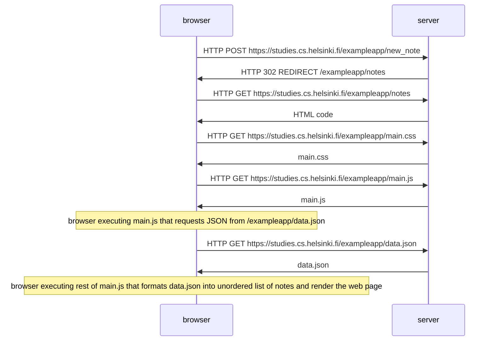
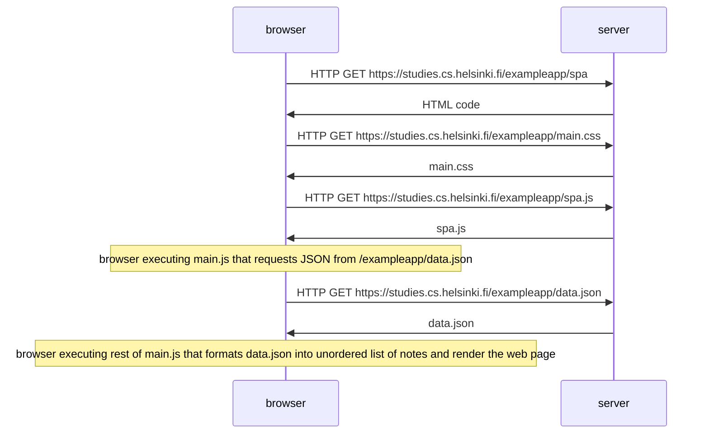
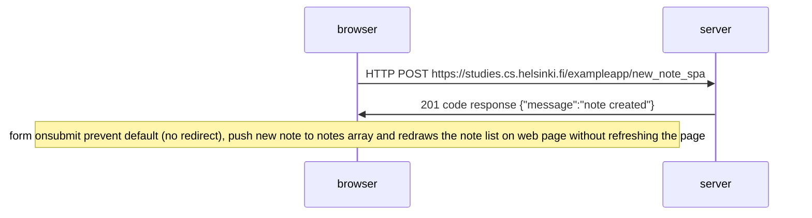

```mermaid
sequenceDiagram
    browser->>server : HTTP POST https://studies.cs.helsinki.fi/exampleapp/new_note
    server->>browser : HTTP 302 REDIRECT /exampleapp/notes
    browser->>server : HTTP GET https://studies.cs.helsinki.fi/exampleapp/notes
    server->>browser : HTML code
    browser->>server : HTTP GET https://studies.cs.helsinki.fi/exampleapp/main.css
    server->>browser : main.css
    browser->>server : HTTP GET https://studies.cs.helsinki.fi/exampleapp/main.js
    server->>browser : main.js
    Note over browser : browser executing main.js that requests JSON from /exampleapp/data.json
    browser->>server : HTTP GET https://studies.cs.helsinki.fi/exampleapp/data.json
    server->>browser : data.json
    Note over browser : browser executing rest of main.js that formats data.json into unordered list of notes and render the web page
```

###title 0.5: Single page app diagram

```mermaid
sequenceDiagram
    browser->>server : HTTP GET https://studies.cs.helsinki.fi/exampleapp/spa
    server->>browser : HTML code
    browser->>server : HTTP GET https://studies.cs.helsinki.fi/exampleapp/main.css
    server->>browser : main.css
    browser->>server : HTTP GET https://studies.cs.helsinki.fi/exampleapp/spa.js
    server->>browser : spa.js
    note over browser : browser executing main.js that requests JSON from /exampleapp/data.json
    browser->>server : HTTP GET https://studies.cs.helsinki.fi/exampleapp/data.json
    server->>browser : data.json
    Note over browser : browser executing rest of main.js that formats data.json into unordered list of notes and render the web page
```

###title 0.6: New note in Single page app diagram

```mermaid
sequenceDiagram
    browser->>server : HTTP POST https://studies.cs.helsinki.fi/exampleapp/new_note_spa
    server->>browser : 201 code response {"message":"note created"}
    Note over browser : form onsubmit prevent default (no redirect), push new note to notes array and redraws the note list on web page without refreshing the page
```
